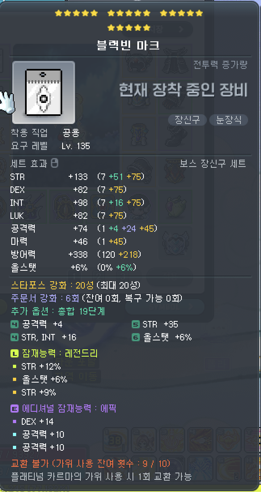

# 2025.04.30 - 4월 4주차 메이플 정리

## 3주차 정리 및 4주차 목표

시작 메소 : 24억 5천, 시작 메포 : 1만

레벨 : 278 70%

### 이번 주 목표

- [x] 블랙빈 마크 구매
- [x] 279렙

## 이번 주 보스 보상 정리

하드 스우 - 블랙 하트 득 (7억 2천)

결정석 - 8억8천 (검밑솔) + 2억 8천 (데벤) + 메세 (3억 8천) + 5억 5천 (하세 이칼 검마 4인격) + 3억 8천 (제논 섀도어) +  2억 6천 (아델 데벤져2) + 7천 (아란) = 28억

## 메잡담

저번주 까지 진행되던 2중 보약이 끝나게 되어서 전투력이 낮아졌다. 대신 아쿠아틱을 20성 블빈마로 교체하여 스펙업을 진행하여 줄어들었던 전투력을 다시 끌어올렸다. 당분간은 해방 이후 큐브를 위하여 메소를 모아야 한다. 더불어서 해방 이후의 카룻 뚝 22성도 사야하므로 3달 동안은 아무것도 못하고 돈을 모아야하지 않을까 싶다.

검밑솔 보상이 너프된 것 때문에 꽤 메소 수급량이 줄어들었다. 아마 패치 전이었으면 결정석으로 35억 이상은 얻지 않았을까 생각한다. 그래도 이번 주에는 하드 스우에서 블랙 하트를 얻은 것 덕분에 감가폭을 메꿀 수 있었다.

3주 후에 해방이 예정되어 있다. 일주일에 30억 메소 정도를 번다고 하면, 해방 이후 메소는 약 100억 정도. 윗잠은 어느 정도 띄울 수 있어도 에디는 공 6퍼 같은 걸로 대충 살아야 할 것 같다. 그 다음 아케인 무기 팔린 걸로 카룻 뚝을 구매하고 나서 에디를 돌려야 할 것 같다.

예전에 친구들과 파티로 하드 루시드, 하드 윌을 시작으로 하드 진힐라, 검은 마법사까지 잡을 때 까지만 해도 엄청 큰 재미를 느꼈었다. 다같이 단계 단계 성장해 나가면서 새로운 보스를 도전해 나가는 것이 힘들지만 뿌듯했다. 하지만 검은 마법사 이후 세렌(그 때 막 아르크스가 나올 시점이었다)은 너무나도 버거운 보스였고, 도전 목표가 사라진 시점에서 점차 흥미를 잃기 시작했다.

하지만 지금은 예전과 같은 그 재미를 다시 느낄 수 있게 되었다. 단순히 파티로 새로운 보스를 잡는 것 뿐만 아니라, 솔플로 예전에 파티로 잡았던 보스를 클리어하는 재미도 생기게 되었다. 진힐라, 듄켈, 더스크와 같은 검밑솔을 시작으로 노말 세렌, 이지 칼로스를 도전하는 재미가 생기기 시작했다. 파티로는 노말 칼로스, 이지 카링을 도전하면서 새로운 재미를 느끼고 있다.

이지 칼로스 솔플 스펙이 될 때까지 열심히 스펙업을 진행해 나가고, 환산 7만이라는 목표에 도달 할 수 있는 템세팅을 목표로 열심히 메소를 벌어야겠다.

## 4주차 정리

현재 메소 : 20억 , 현재 메포 : 1700

레벨 : 279 6%

### 다음 목표

- [ ] 해방을 위한 메소 존버 - 해방할 때 까지 100억 메소 모으기
- [ ] 280레벨
